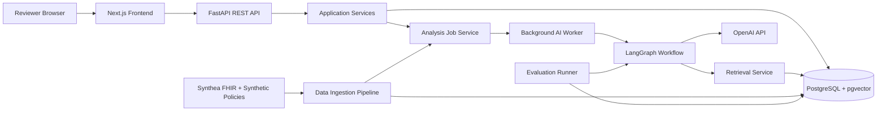
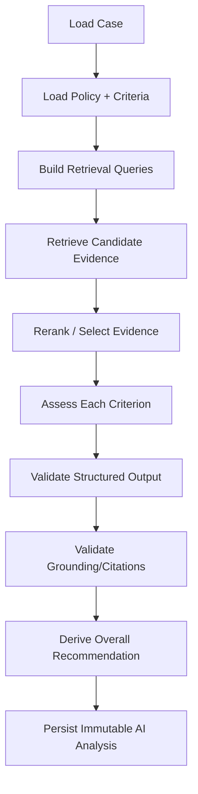
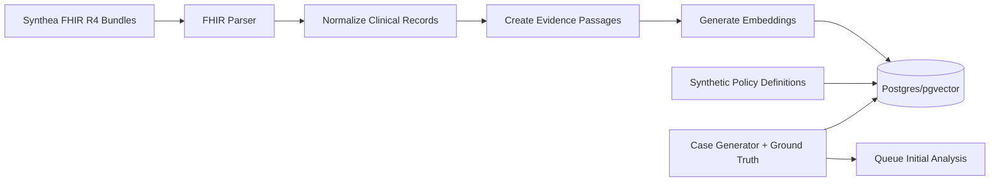

# 04 — System Architecture

## 1. Architecture goals
- make evidence traceability a first-class data concept;
- keep AI orchestration separate from HTTP/UI;
- allow frontend completion before backend exists;
- support real persistent reviewer ownership/audit in backend phase;
- keep MVP locally runnable without Docker/cloud requirements;
- permit future replacement of OpenAI or pgvector without rewriting domain logic.

## 2. System context


## 3. Frontend architecture
### Technology
- Next.js App Router
- React
- TypeScript
- Tailwind CSS
- TanStack Query
- React built-ins for local UI state

### Mandatory boundary
UI -> hooks/query layer -> domain service interface -> implementation.

During frontend-only phase:
`MockCaseService`, `MockAuthService`, `MockReviewService`, `MockPatientService`, `MockEvaluationService`.

During integrated phase:
corresponding `Api*Service` classes/functions call FastAPI.

No component knows which implementation is active.

## 4. Backend layers
```text
backend/
  app/
    api/              # FastAPI routers, HTTP mapping
    application/      # use cases/application services
    domain/           # entities, enums, invariants, pure policy helpers
    infrastructure/   # DB, OpenAI, embeddings, FHIR, repositories
    ai/               # LangGraph state/nodes/prompts/validators
    jobs/             # analysis job runner/worker loop
    evaluation/       # evaluators and reports
    settings/         # configuration
```

### API layer
Responsibilities:
- authentication dependency;
- request/response validation;
- HTTP status mapping;
- call application services.
No business logic, SQL, prompts, or embeddings.

### Application layer
Use cases such as:
- AuthenticateReviewer
- ListCases
- GetCaseDetail
- ClaimCase
- SaveReviewProgress
- AddReviewerNote
- OverrideCriterion
- SubmitFinalDecision
- GetPatientTimeline
- GetAIQualityMetrics
- IngestSyntheticBatch
- QueueCaseAnalysis

### Domain layer
Pure business concepts and invariants. Must not import FastAPI, SQLAlchemy, OpenAI SDK, or LangGraph.

### Infrastructure layer
- PostgreSQL repositories;
- pgvector queries;
- FHIR parser/normalizer;
- OpenAI client adapters;
- embedding provider;
- job persistence;
- logging.

## 5. Database architecture
PostgreSQL is both transactional store and vector store via pgvector.

Relational tables hold reviewers, cases, policies, criteria, analysis versions, review state, audit history, ground truth.

Evidence passages include a `vector` embedding column. Start with exact vector search for small MVP datasets; HNSW can be added when volume requires it. pgvector supports exact nearest-neighbor search by default and HNSW/IVFFlat approximate indexes. Official source: https://github.com/pgvector/pgvector

## 6. AI architecture
LangGraph is orchestration, not business truth.

Recommended graph:


Use deterministic Python wherever rules can be explicit. Use LLM only where semantic interpretation is needed.

## 7. Background job architecture
MVP does not require Celery/Redis.

Use a persistent `analysis_jobs` table plus a lightweight worker process/loop:
1. API/data ingestion inserts queued job.
2. Worker claims job using safe DB locking.
3. status -> Running.
4. execute graph.
5. success -> persist analysis + Ready for Review (if unassigned).
6. recoverable failure -> create/advance retry attempt up to 3 total.
7. final failure -> Analysis Failed.

This design is intentionally replaceable by a full queue later.

## 8. Authentication architecture
FastAPI password/bearer pattern with secure hashing and JWT or similarly straightforward signed token.
Official FastAPI guidance: https://fastapi.tiangolo.com/tutorial/security/oauth2-jwt/

MVP reviewers are seeded into DB. No registration endpoint.

## 9. Data ingestion architecture


FHIR R4 source: https://www.hl7.org/fhir/R4/
Synthea source: https://github.com/synthetichealth/synthea

## 10. Evaluation architecture
Evaluation is not performed by visually inspecting outputs only.
- ground truth is generated/stored separately;
- analysis results are scored programmatically;
- metric aggregation is stored or computed for AI Quality page;
- failure examples preserve category and expected/observed difference.

## 11. Failure isolation
- API failure does not corrupt analysis job state.
- model call failure can retry.
- malformed structured output can retry within graph/job policy.
- invalid citations fail grounding validation rather than being silently displayed.
- failed analysis leaves case visible but unclaimable.

## 12. Configuration
Environment variables at minimum:
- `DATABASE_URL`
- `OPENAI_API_KEY`
- `OPENAI_CHAT_MODEL`
- `OPENAI_EMBEDDING_MODEL`
- `JWT_SECRET_KEY`
- `ACCESS_TOKEN_EXPIRE_MINUTES`
- `APP_ENV`
- `LOG_LEVEL`

Never commit `.env`.

## 13. Deployment boundary
Production deployment is not MVP acceptance scope. Local architecture must nevertheless avoid assumptions that prevent later containerization/cloud deployment.
